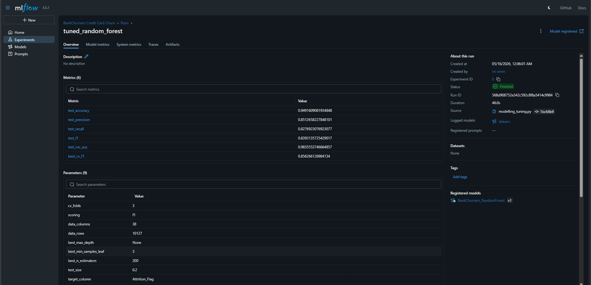
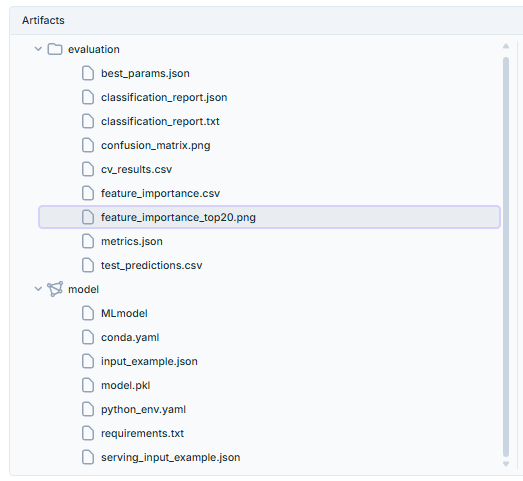

# Eksperimen SML Amin - BankChurners

Repository ini berisi eksperimen, preprocessing otomatis, dan training model untuk submission kelas Dicoding **Membangun Sistem Machine Learning (MSML)**.

Project menggunakan dataset BankChurners untuk klasifikasi customer churn. Fokus utama project adalah alur MLOps sederhana: preprocessing otomatis, training model, MLflow Tracking, logging artifact, dan integrasi DagsHub.

## MLflow Dashboard



## MLflow Artifacts



## Dataset

Dataset yang digunakan:

```text
Credit Card Customers / BankChurners
```

Sumber dataset:

```text
https://www.kaggle.com/datasets/sakshigoyal7/credit-card-customers
```

Target klasifikasi:

```text
Attrition_Flag
```

Mapping target:

```text
Existing Customer = 0
Attrited Customer = 1
```

## Struktur Project

```text
Eksperimen_SML_Amin
|-- .github
|   `-- workflow
|       `-- ml-pipeline.yml
|-- artifacts
|   `-- tuning
|       |-- best_params.json
|       |-- classification_report.json
|       |-- classification_report.txt
|       |-- confusion_matrix.png
|       |-- cv_results.csv
|       |-- feature_importance.csv
|       |-- feature_importance_top20.png
|       |-- metrics.json
|       `-- test_predictions.csv
|-- preprocessing
|   |-- automate_amin.py
|   |-- BankChurners_preprocessing.csv
|   `-- eksperimen_amin.ipynb
|-- BankChurners.csv
|-- conda.yaml
|-- MLproject
|-- modelling.py
|-- modelling_tuning.py
|-- README.md
`-- requirements.txt
```

## Requirements

Environment utama:

```text
Python 3.12.7
mlflow==2.19.0
```

Library utama:

```text
pandas
numpy
scikit-learn
matplotlib
seaborn
mlflow
dagshub
```

## Installation

Disarankan menggunakan Conda:

```bash
conda env create -f conda.yaml
conda activate bankchurners-mlflow
python --version
```

Jika environment sudah pernah dibuat:

```bash
conda env update -f conda.yaml --prune
conda activate bankchurners-mlflow
```

Alternatif menggunakan pip:

```bash
python -m pip install --upgrade pip
python -m pip install -r requirements.txt
```

## Preprocessing

Jalankan preprocessing otomatis:

```bash
python preprocessing/automate_amin.py
```

Output preprocessing:

```text
preprocessing/BankChurners_preprocessing.csv
```

Tahapan preprocessing:

```text
load dataset
drop ID/leakage columns
encode target
handle missing values
one-hot encode categorical features
scale numerical features
save processed dataset
```

## Training dengan MLflow Lokal

Jalankan MLflow Tracking Server:

```bash
mlflow server --host 127.0.0.1 --port 5000 --backend-store-uri mlruns --default-artifact-root mlartifacts
```

Jalankan baseline training:

```bash
python modelling.py
```

Jalankan hyperparameter tuning dan artifact logging:

```bash
python modelling_tuning.py
```

Default tracking URI:

```text
http://127.0.0.1:5000/
```

## MLflow Project

Project juga dapat dijalankan menggunakan MLflow Project:

```bash
mlflow run . -e baseline
```

atau:

```bash
mlflow run . -e tuning
```

Jika ingin memakai environment aktif tanpa membuat environment baru:

```bash
mlflow run . -e tuning --env-manager=local
```

## DagsHub

Pastikan sudah login ke DagsHub dan repository sudah terhubung.

Default repository DagsHub:

```text
Ini-Amin/Eksperimen_SML_Amin
```

Jalankan training ke DagsHub:

```bash
USE_DAGSHUB=true python modelling_tuning.py
```

PowerShell:

```powershell
$env:USE_DAGSHUB="true"
python modelling_tuning.py
```

Jika owner atau nama repository berbeda:

```bash
DAGSHUB_REPO_OWNER=<owner> DAGSHUB_REPO_NAME=<repo> USE_DAGSHUB=true python modelling_tuning.py
```

PowerShell:

```powershell
$env:DAGSHUB_REPO_OWNER="<owner>"
$env:DAGSHUB_REPO_NAME="<repo>"
$env:USE_DAGSHUB="true"
python modelling_tuning.py
```

## Artifact yang Dihasilkan

`modelling_tuning.py` menghasilkan artifact evaluasi berikut:

```text
best_params.json
classification_report.json
classification_report.txt
confusion_matrix.png
cv_results.csv
feature_importance.csv
feature_importance_top20.png
metrics.json
test_predictions.csv
```

Model juga dilog ke MLflow pada artifact path:

```text
model
```

Struktur model MLflow berisi file seperti:

```text
MLmodel
conda.yaml
model.pkl
python_env.yaml
requirements.txt
input_example.json
serving_input_example.json
```

## Hasil Tuning Terakhir

Best parameter:

```text
max_depth = None
min_samples_leaf = 3
n_estimators = 200
```

Metrik test:

```text
accuracy = 0.9492
precision = 0.8513
recall = 0.8277
f1 = 0.8393
roc_auc = 0.9836
```
